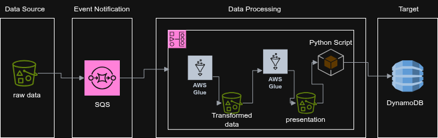

# Data Pipeline With Airflow and Glue
## Real-Time Music Streaming Data Pipeline
A real-time data pipeline for processing music streaming behavior using Apache Airflow, AWS Glue, and DynamoDB.


### Problem Description
- Music streaming data arrives in batch files at unpredictable intervals via Amazon S3. 
- The pipeline must: - Process and validate incoming data in near real-time. 
- Compute daily KPIs (per genre and song). - Store results in DynamoDB for downstream consumption.

### Objectives
- **Ingest streaming data from S3**.
Orchestrate the pipeline using Apache Airflow (locally via Astro or on MWAA).
Perform transformation and KPI computation with AWS Glue (PySpark + Python Shell).


## System Architecture

### Local Setup Using Astro (Astro CLI)
Install Astro CLI:
```
https://docs.astronomer.io/astro/cli/install-cli
```

Clone the repository: 
```bash 
git clone https://github.com/your-org/music-streaming-pipeline.git cd music-streaming-pipeline
```
Start the Astro project: 
```bash 
astro dev start
```

Run DAG manually 

Use .env or AWS profiles to pass credentials to Glue and S3.

### Deployment on MWAA
- Package DAG folder and upload to S3 MWAA DAGs location
- Update your MWAA Environment with:
   -  Required Python libraries in requirements.txt
- IAM role permissions for:
  - S3 (read/write)
  - AWS Glue (start job/run)
   - DynamoDB (PutItem/BatchWriteItem)
- Trigger DAG from Airflow UI 

### Features

- When a new file is uploaded to Amazon S3, an event notification is sent to an Amazon SQS queue.
- Apache Airflow continuously polls the SQS queue for new S3 event messages.
- Upon detecting a new event:

    - The pipeline validates the incoming data,

    - Processes it using AWS Glue, and

    - Loads the computed metrics into Amazon DynamoDB for downstream access.


**Sample of dag run**
.png)